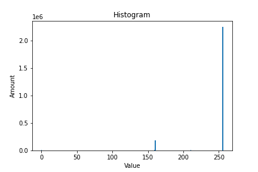
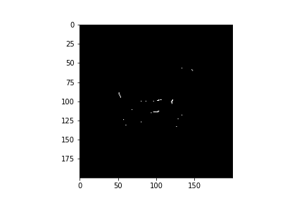

# Rock Art Vision

Computer vision 👁️ program for Rock Art analysis. 

## Introduction

_This program is part of my work to obtain Electronic Engineering degree._ 🤕

Here a methodology for the organisation and analisys of rock art data from Arica y Parinacota region is being proposed. 
Workig with drawings from these artifeacts a curvature analisys is being developed for a automatic classification.
Also, manim animations are beign studied for visualization purpose during the final presentation.

## Progress
The following list is the code composition and its progress: 

_this list is going to be updated everyday (i wish)_

Symbology: ✅ = Ready, ☑️ = In progress, ⏰ = In waiting

* Automatic Classification: ☑️
  * Preprocessing: ✅
    * Thresholding. ✅
    * First moment of area. _(getting the center)_ ✅
    * Second moment of area. _(getting the orientation)_ ✅
    * Resizing. ✅
    * Initialization. ✅

  * Segmentation: ☑️
    * Control points.✅
    * Contour lines.✅
      * Greedy algorithm. ✅
      * Active contour model.☑️
    * Initialization. ⏰

  * Curvature Scale Space mapping (CSS-map): ☑️
    * Contour initializacion. ☑️
    * -the rest of the code- ⏰

  * Support Vector Machine algorithm (SVM): ⏰
  
* Visualization: ⏰
_manim animation for presenting the final work_
## Some code.
_for you to believe in my programming abilities_
### Preprocessing

Here im gonna show some functions from `imagen.py` file

We are starting with this drawing, an interpretation from a rock art.
<br />
As you can see its a really easy image to work with. If you were asking why, its because its a *binary image*, it means we are only working with one channel (array or matrix) instead of three (the case of colored image).
#### Thresholding
For us to know which should be the range of values for this kind of image, we should extract as *histogram*, something like the spectrum of this image.
```python
img = Imagen(r'C:\\...\images_raw\img.tif')
plt.hist(img.img.ravel(),256,[0,256])
plt.show
```
<br />
This is how we should be hable to know where to apply the threshold.
Applying 
```python
thresh = img.thresh()
plot(thresh)
```
<br />

#### First moment of area 
This is a real important feature for us to positioning the object at the center of the image.
The function was coded following the next formula._<br />
<br />
and <br />
<br />

```python
fm = img.first_moment()
plot(fm)
```
<br />

#### Second momento of area.
<br />

### Segmentation.
First we define a vector of point for us to start the contour algorithm
<br />

### Greedy alhorithm.

In this section the a greedy approach is used for the control points to fit the contour of the images. For us to do that, first we defined a energy image, gived by the Blurred Gradient Magnitude Squared.<br />

<br />
<br />

The algorithm is supossed to search for the maximum of the evergy funtion. In a mathematics language:<br />

<br />
Currently the function `def contour()` are giving the next results:<br />

<br />

So we have to add some constrains and start reaching the optimal contour for the CSS-maping
